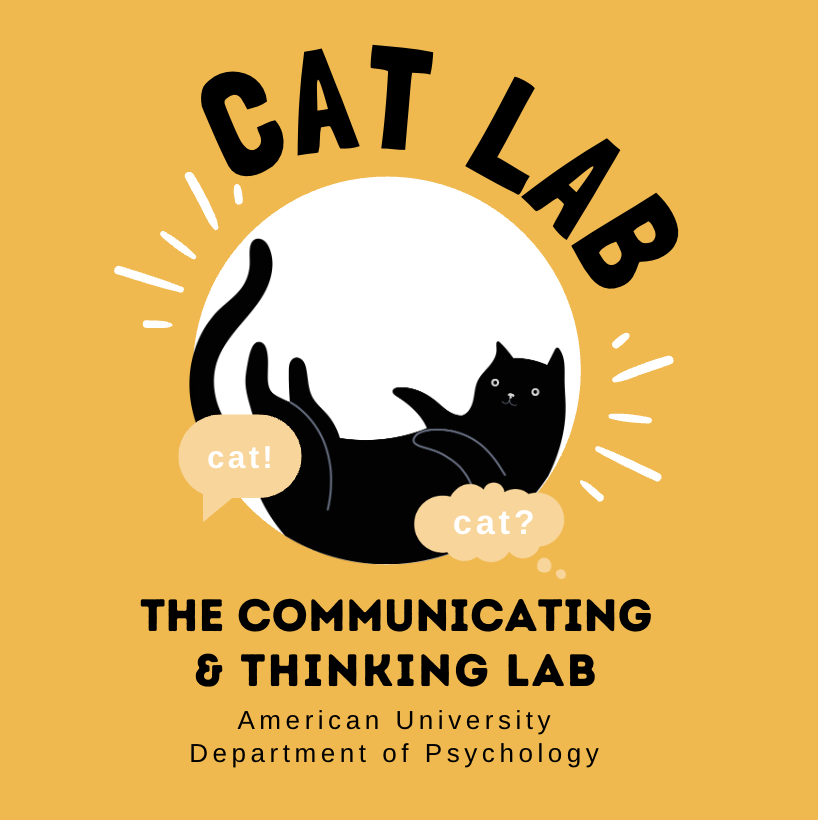

```{=html}
<div class="home-hero">
 
</div>

<p class="home-desc">
Welcome to the Communicating & Thinking lab! We are part of the <b>Department of Psychology</b> and the <b>Behavior, Cognition, and Neuroscience (BCaN) program</b> at <b>American University</b>. We study the relationship between language, thought, and social cognition through the lens of cognitive science.</p>

<div class="home-divider"></div>
<p class="home-desco">If you are a <b>participant</b> trying to contact us, please email us. Our lab is in Asbury Hall 315.</p>

<p class="home-desc">If you are interested in <b>joining the lab</b>, you can find more information on our Research page.</p>


```
