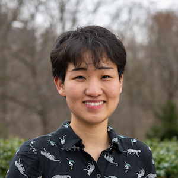
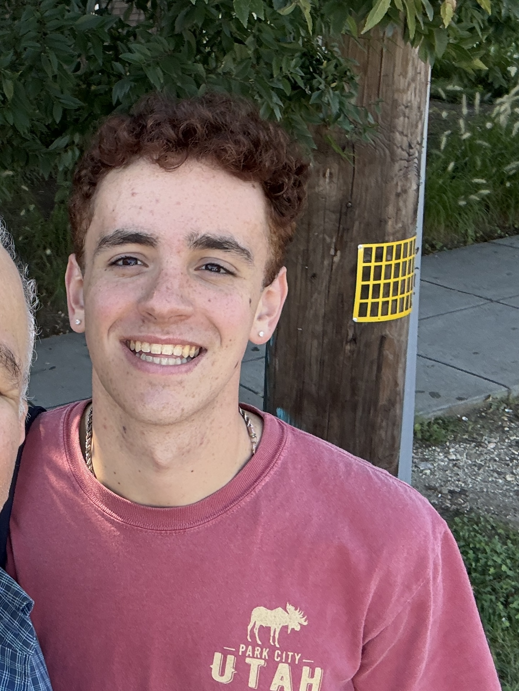
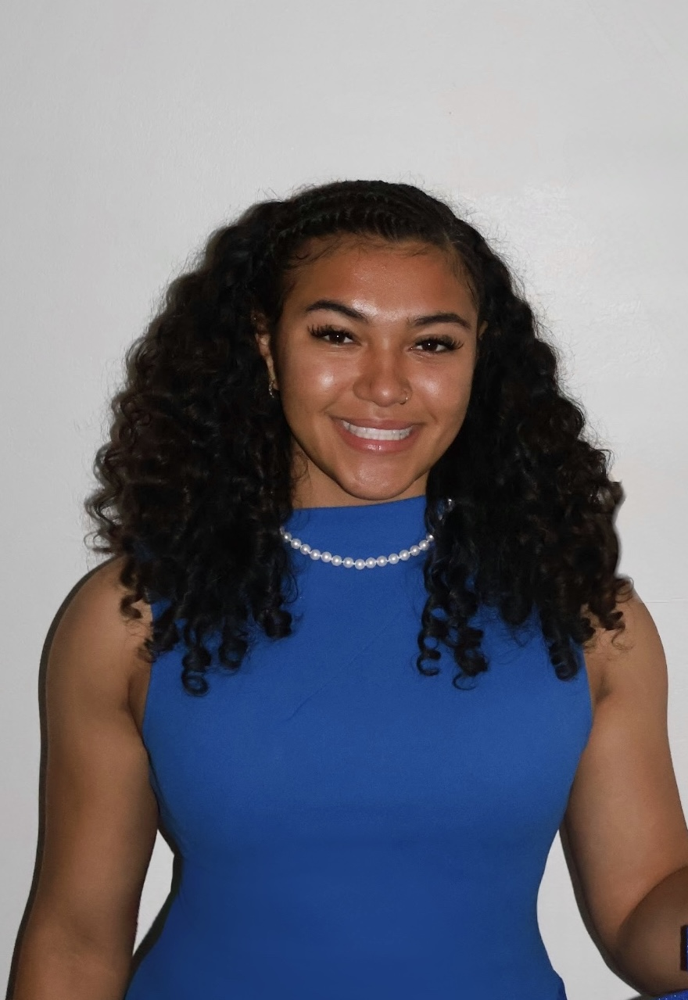
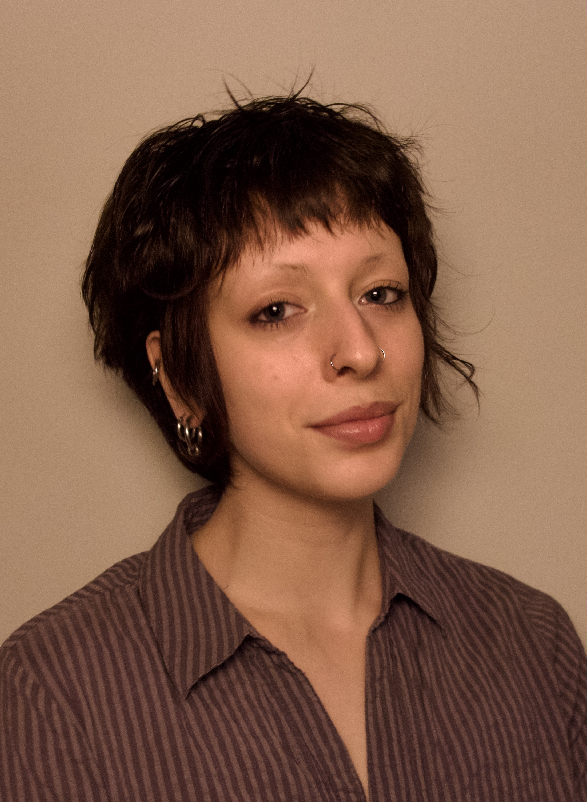
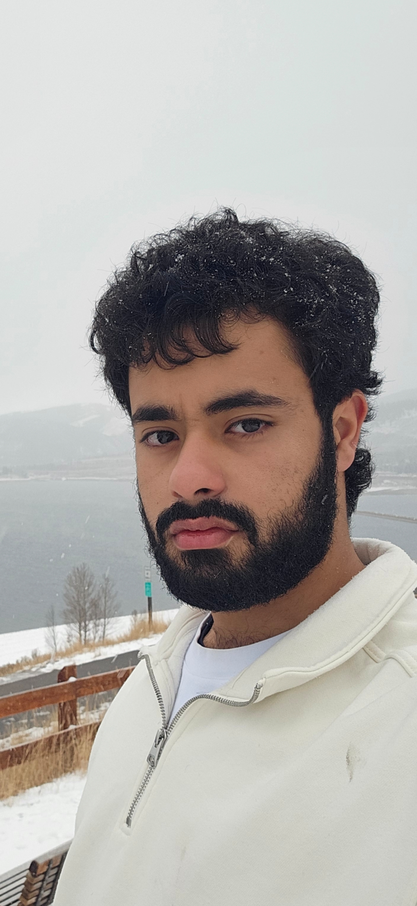

```{=html}
<div class="page-title">People</div>

<div class="sect-label">Principal investigator</div>

<div class="person-card">
  
  <div>
    <div class="person-name">Judy Sein Kim</div>
    <div class="person-role">Assistant Professor, Psychology</div>
    <div class="person-bio">Judy (she/they) is an Assistant Professor in the Psychology Department at American University. Previously, she was a postdoc at Princeton and Yale in the Crockett Lab. She received her PhD in Experiment Psychology at Johns Hopkins University in the Neuroplasticity & Development Lab. Outside the lab, Judy is passionate about community organizing, crafts, foraging for mushrooms, and BTS. </div>
    <div class="person-links">
      <a href="mailto:judy@university.edu">✉ email</a>
      <a href="https://scholar.google.com/citations?user=ZCMTDXAAAAAJ&hl=en&inst=5803104576075509644">Google Scholar</a>
      <a href="https://drive.google.com/file/d/16i5KkVd2C32mDI19wGosU5rPk6wdL8IC/view?usp=sharing">CV</a>
    </div>
  </div>
</div>


<div class="sect-label">Undegraduate students</div>

<div class="person-card">
  
  <div>
    <div class="person-name">Jake Isolda </div>
    <div class="person-role">Senior, Psychology & Neuroscience</div>
    <div class="person-bio">Jake (he/him) is a senior studying psychology and neuroscience. He is interested in the psychological and neurobiological underpinnings of thought and memory. He enjoys going to concerts and spending time outdoors as well as working with kids when he can. Jake will be joining the CAT lab as a PhD student in the Behavior, Cognition, and Neuroscience PhD program in fall of 2026. </div>
    <div class="person-links"><a href="mailto:ji7320a@american.edu">✉ email</a></div>
  </div>
</div>

<div class="person-card">
  
  <div>
    <div class="person-name">Ciera Thacker </div>
    <div class="person-role">Junior, Psychology & Neuroscience minor</div>
    <div class="person-bio">Ciera (she/her) is a junior majoring in Psychology with a minor in Neuroscience at American University. Her interests include internal cognitive processes related to communication and thought, as well as memory and executive functioning and their relationships to behavior and daily functioning. More broadly, she is interested in how changes in cognitive systems across neurological conditions affect independence and quality of life. Outside the lab, Ciera is a Division I student-athlete and serves as President and Director of Mental Health Initiatives for the Student-Athlete Advisory Committee and Health Chair of the NAACP chapter. Ciera plans to pursue doctoral training in clinical psychology focused on brain-behavior relationships.</div>
    <div class="person-links"><a href="mailto:ct4053a@american.edu">✉ email</a></div>
  </div>
</div>

<div class="person-card">
  
  <div>
    <div class="person-name">Devon Beyonara </div>
    <div class="person-role">Senior, Psychology</div>
    <div class="person-bio">Devon (they/them) is a senior majoring in Psychology. They are interested in identity research, creative therapies, and the interaction between nature and child development. Outside the lab, they rock climb, make zines, and are on an improv troupe! They hope to spread love and do cool science.</div>
    <div class="person-links"><a href="mailto:db2184a@american.edu">✉ email</a></div>
  </div>
</div>

<div class="person-card">
  
  <div>
    <div class="person-name">Bakhit Alktebi</div>
    <div class="person-role">Junior, Psychology & Data science minor</div>
    <div class="person-bio">Bakhit (he/him) is a junior majoring in Psychology with a minor in Data science. He is interested in how different communication styles change people's perception of others. Outside the lab, he enjoys jiu jitsu, biking, and reading interesting non-fiction books. He aspires to open a social/cognitive psychology lab of his own and teach as well.</div>
    <div class="person-links"><a href="mailto:ba4554a@american.edu ">✉ email</a></div>
  </div>
</div>

```
