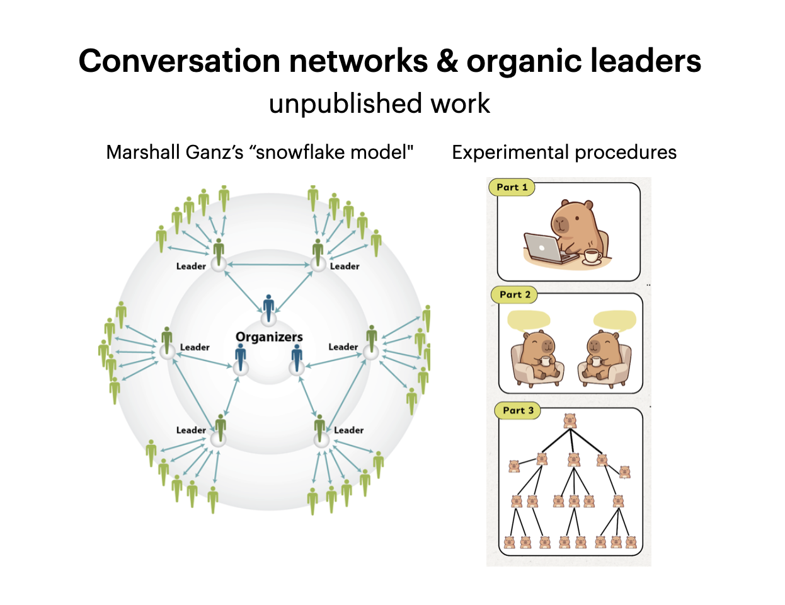
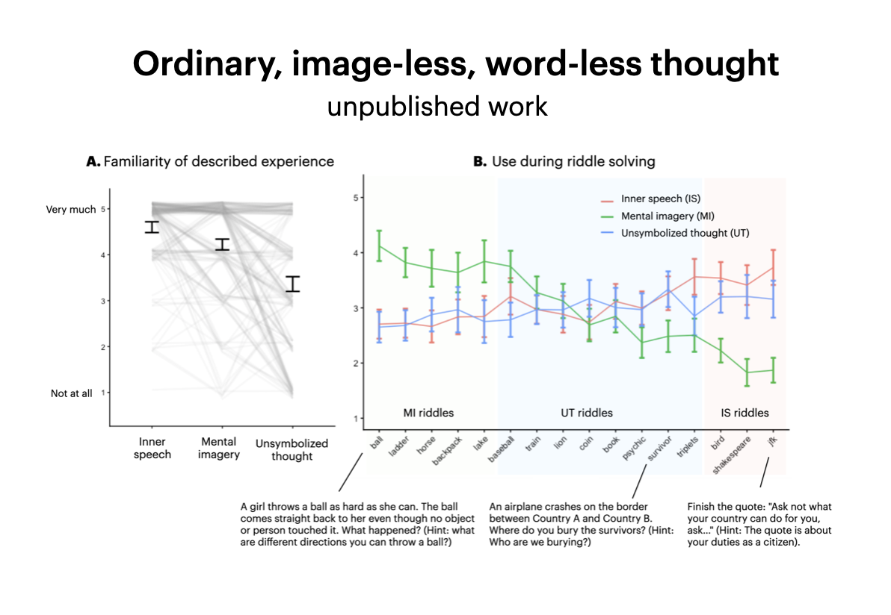
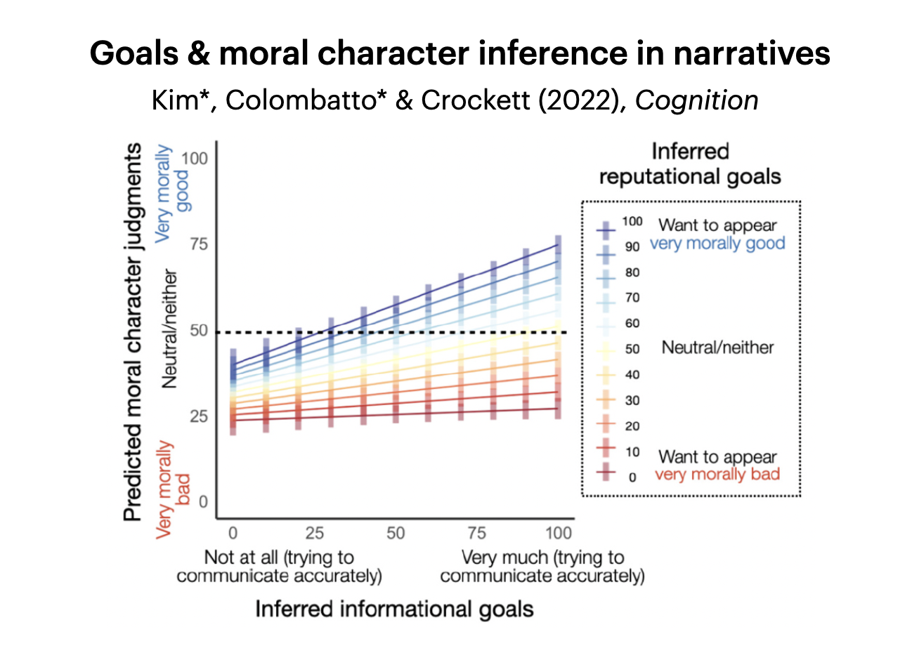
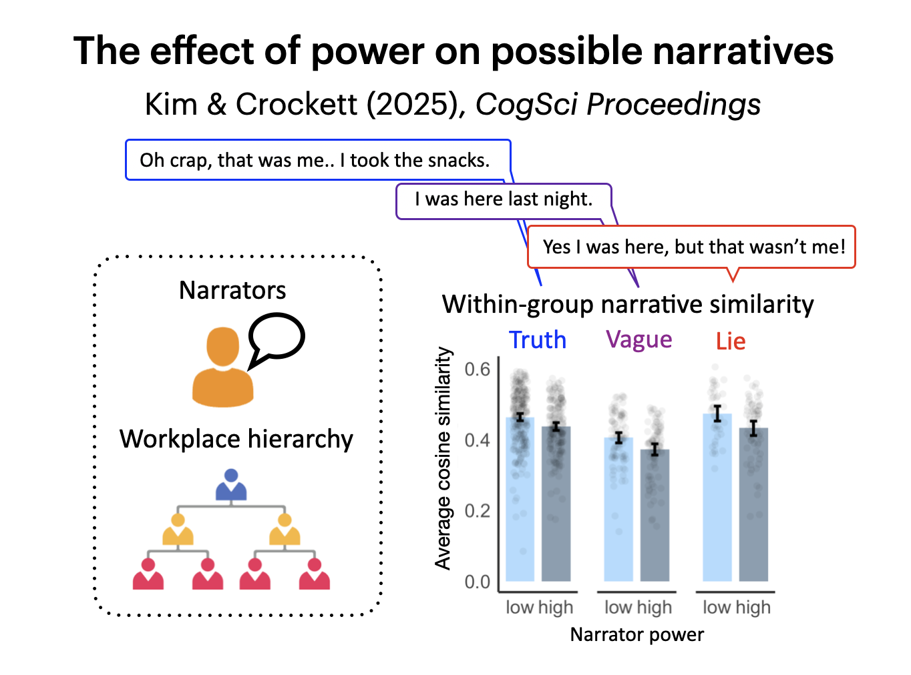
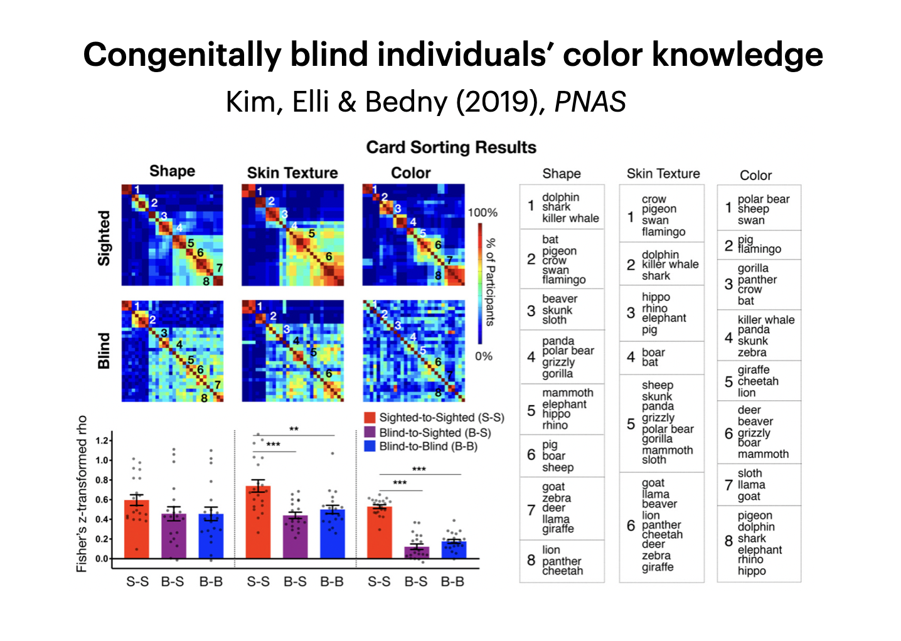

```{=html}
<div class="page-title">Research</div>

<p class="projects-intro">
We study the relationship between language, thought, and social cognition through the lens of cognitive science. Some of our key research questions are: </p>

<ul class="projects-intro">
  <li>How do we articulate our thoughts <b>to ourselves</b>?</li>
  <li>How do we communicate our thoughts <b>to other people</b>?</li>
  <li>How do we make sense of <b>what other people say</b>?</li>
  <li><b>When, where, and with whom</b> do we communicate?</li>
  <li>When does communication lead to <b>conceptual and belief change</b>?</li>
  <li>How does knowledge spread through <b>communicative networks</b>?</li>
  <li>What role does communication play in <b>communities and relationships</b>?</li>
</ul>

<p class="projects-intro">
Our lab primarily uses large-scale behavioral experiments with adults (online and in-lab). We are currently focused on expanding our work to include community-based participatory research (CBPR) methods. But our past projects have drawn on a wide range of approaches, and we actively welcome interdisciplinary collaborations—for example, using fMRI, computational modeling, developmental methods, or clinical populations. </p>

<p class="projects-intro">
Interdisciplinary work is a core priority for our lab. In addition to cognitive and social psychology, our research integrates perspectives from linguistics (pragmatics and psycholinguistics), philosophy (philosophy of mind and social epistemology), and, more recently, political science and sociology—particularly in projects on social movements, collective action, and democracy. </p>

<div class="sect-label">Research Projects</div>

<p class="projects-intro">Here's a list of current and past projects, with key questions and representative ppapers. The most recent projects are listed first. 

<div class="project-panel">
  <div class="proj-fig">
    
  </div>
  <div class="proj-body">
    <div class="proj-title">Conversations in community organizing</div>
    <div class="proj-desc"> What kinds of conversations are most conducive to community-building and collective action? What motivates people to initiate and sustain communication with other people? What kinds of knowledge do people have about their social and communicative networks? 
</div>
  </div>
</div>

<div class="project-panel">
  <div class="proj-fig">
    
  </div>
  <div class="proj-body">
    <div class="proj-title">The phenomenology of thought</div>
    <div class="proj-desc">What does thinking feel like? Do we all experience thinking in the same way? What kinds of representations support thinking (e.g., mental imagery, inner speech)? How well do we articulate our thoughts using language? 
</div>
  </div>
</div>

<div class="project-panel">
  <div class="proj-fig">
    
  </div>
  <div class="proj-body">
    <div class="proj-title">Moral narratives & intuitive theories of morality </div>
    <div class="proj-desc">What is a narrative, and what do they communicate? How do we tell narratives about our own moral actions? How do moral narratives shape our theories about other people’s moral characters? </div>
  </div>
</div>

<div class="project-panel">
  <div class="proj-fig">
    
  </div>
  <div class="proj-body">
    <div class="proj-title">Vagueness, epistemic vigilance, & testimonial injustice </div>
    <div class="proj-desc">Why do people use vague language? How do we exercise epistemic vigilance to guard against misinformation? How do power dynamics affect how we give and receive credibility? </div>
  </div>
</div>

<div class="project-panel">
  <div class="proj-fig">
    
  </div>
  <div class="proj-body">
    <div class="proj-title">Communication across people with different life experiences </div>
    <div class="proj-desc">What can we learn about experiences very different from our own? What kinds of theories do we have about other people’s experiences?</div>
  </div>
</div>

```